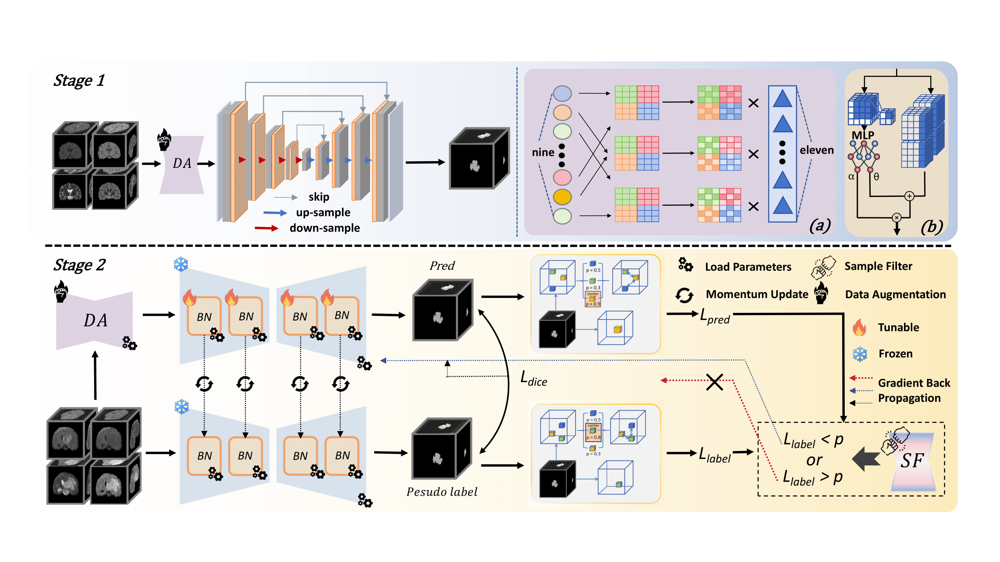

# DR-TTA

We propose a test-time adaptation method called DR-TTA (Dynamic and Robust Test-Time Adaptation). This method employs a dual-branch teacher-student architecture, where the teacher provides pseudo-label supervision, and the student adapts to domain shifts through augmented target samples. Additionally, DR-TTA integrates momentum updates and adaptive Batch Normalization to enhance feature alignment and maintain source knowledge.

Visual comparison of segmentation results on the BRATS-SSA and BRATS-SIM datasets. NoTTA indicates results before the different domain adaptation methods. Color legend: WT = red + green + blue, TC = red + blue, ET = red.

## 1.Envirenment
- Please prepare an environment with python=3.8, and then use the command "pip install -r requirements.txt" for the dependencies.

## 2.Pre-Train in the source domain(BraTS2024)
- Run train_source.py to get pre-trained weight

## 3.Test-time adaption in the target domain(BraTS-SSA)
- Run run_3d_upl.py to get the result in the target domain.It contains both train and test process.
